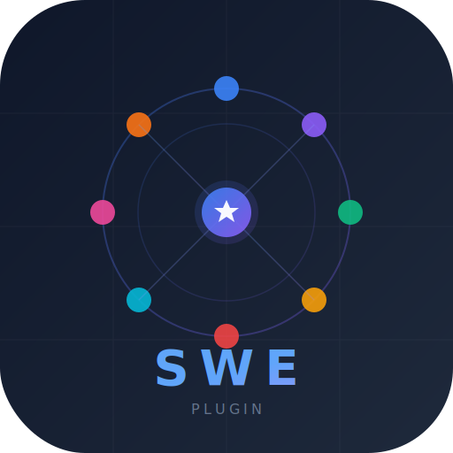

<p align="center">
  
</p>

<h1 align="center">Claude SWE Plugin</h1>

<p align="center">
  <strong>A full software engineering team inside Claude Code.</strong><br>
  CEO orchestrator + 8 specialized agents + 9 skills = from idea to production.
</p>

<p align="center">
  <a href="#quick-start">Quick Start</a> &middot;
  <a href="#the-team">The Team</a> &middot;
  <a href="#skills">Skills</a> &middot;
  <a href="#the-pipeline">Pipeline</a> &middot;
  <a href="#architecture">Architecture</a>
</p>

---

## What Is This?

A Claude Code plugin that transforms Claude into a full software engineering organization. Instead of one AI doing everything, you get a **CEO orchestrator** that delegates work to specialized agents — each with deep domain expertise, clear responsibilities, and strict rules of engagement.

The CEO doesn't write code. The developer doesn't write tests. The tester doesn't touch production code. The designer creates prototypes, not implementations. Everyone has a lane, and the reviewer makes sure nobody crosses it.

## Installation

### From GitHub Marketplace (recommended)

```bash
# Add the marketplace
/plugin marketplace add yarikleto/claude-swe-plugin

# Install the plugin
/plugin install claude-swe-plugin@yarikleto-claude-swe-plugin
```

Or use the interactive plugin manager:
```
/plugin
# → Discover tab → find "claude-swe-plugin" → Install
```

### From GitHub (manual)

```bash
# Clone the repo
git clone https://github.com/yarikleto/claude-swe-plugin.git

# Start Claude Code with the plugin loaded from local directory
claude --plugin-dir /path/to/claude-swe-plugin
```

### Managing the plugin

```bash
# Disable without uninstalling
/plugin disable claude-swe-plugin@yarikleto-claude-swe-plugin

# Re-enable
/plugin enable claude-swe-plugin@yarikleto-claude-swe-plugin

# Update to latest version
/plugin update claude-swe-plugin@yarikleto-claude-swe-plugin

# Uninstall
/plugin uninstall claude-swe-plugin@yarikleto-claude-swe-plugin

# Reload after local changes (dev mode)
/reload-plugins
```

## Quick Start

Once installed, kick off a new project:

```bash
/claude-swe-plugin:swe-init
```

That's it. The CEO will start a conversation with you, understand what you want to build, and drive the entire process.

## The Team

The plugin creates a virtual engineering organization with 8 specialized agents, orchestrated by a CEO persona defined in your project's `CLAUDE.md`.

<table>
<tr>
<td width="50%" valign="top">

### CEO (You / CLAUDE.md)
The orchestrator. Thinks like Bezos (Type 1/Type 2 decisions), Jobs (focus = saying no), Musk (first principles). Never writes code. Delegates everything. Plays devil's advocate. Runs pre-mortems. Uses the Editor Model for delegation (Rabois).

### Designer
Aesthetic sensibility trained on Dieter Rams, Jony Ive, and Swiss design. Knows color theory (60-30-10), typography (modular scale), layout (8px grid). Researches Mobbin/Dribbble/Awwwards before designing. Creates Excalidraw wireframes and HTML+Tailwind interactive prototypes. Adapts to project type (web, mobile, CLI, API).

### UX Engineer
Ensures products are genuinely usable, not just beautiful. Nielsen's 10 Heuristics as a concrete checklist. Checks cognitive load (Miller's, Hick's, Fitts's laws). WCAG AA accessibility is non-negotiable. Catches dark patterns, modal overuse, unhelpful errors, mystery meat navigation.

### Architect
Thinks in trade-offs (Richards & Ford). Starts simple (Gall's Law). Boring technology by default (McKinley). Classifies decisions as Type 1/Type 2. Writes ADRs. Creates C4 diagrams. Knows when to use modular monolith vs microservices vs event-driven vs hexagonal. Designs for failure.

</td>
<td width="50%" valign="top">

### Developer
Data structures first, code second (Torvalds). Makes TDD tests green, then refactors (Beck). Eliminates edge cases through better design, not conditionals (Torvalds' "good taste"). Immutability and pure functions by default (Hickey, Carmack). **Forbidden from touching test files.**

### Tester (TDD)
Kent Beck's Three Laws of TDD. Writes failing tests BEFORE the developer writes code. Test list first, then Red-Green-Refactor. Equivalence partitioning, boundary values, state transitions, error guessing. Knows the test doubles taxonomy (Meszaros). **Forbidden from touching production code.**

### Reviewer
Triple gatekeeper: (1) Iron Rule — developer didn't touch tests, tester didn't touch code. (2) Anti-cheat — catches hardcoded returns, condition-matching, stub code, incomplete implementations. (3) Code quality — correctness, security, edge cases. Nothing ships without APPROVE.

### DevOps
CI/CD, Docker, cloud, domains, CDN, SSL, monitoring. Starts simple (PaaS > K8s). "If it hurts, do it more often." Creates handoff guides for things the client must do (domain purchase, cloud accounts, API keys). Works with architect to ensure the system actually runs in production.

### Researcher
Intelligence analyst with 6 modes: market/domain research, codebase exploration, technology evaluation, UX research, bug investigation, infrastructure comparison. BLUF reporting. Confidence levels. Any agent can delegate here.

</td>
</tr>
</table>

## The Iron Rule

> **Developer MUST NOT touch test code. Tester MUST NOT touch production code.**

This is the most important rule in the system. The person who writes the spec (tests) is never the person who implements it. The reviewer enforces this with automatic BLOCKER on any violation.

## Skills

| Skill | Purpose | Runs |
|-------|---------|------|
| `/swe-init` | Project kickoff — conversation with client, product vision, prototypes, iterate until approved | CEO + Designer + UX Engineer |
| `/swe-design-spec` | Extract design specification from approved prototype (tokens, components, screens) | Designer |
| `/swe-design` | System design — architecture, ADRs, data model, APIs, C4 diagrams | Architect + DevOps |
| `/swe-deploy` | Infrastructure setup — CI/CD, Docker, hosting, CDN, monitoring + client handoff guides | DevOps |
| `/swe-tasks` | Decompose system design into tasks with statuses, dependencies, acceptance criteria | Architect |
| `/swe-test-plan` | Test strategy — frameworks, pyramid, coverage map, Definition of Done | Tester |
| `/swe-sprint` | Execute the task cycle: tester(Red) → developer(Green) → reviewer → designer/UX → DONE | CEO orchestrates all |
| `/swe-brief` | CEO revisits product vision, checks reality vs plan, updates strategic documents | CEO + Researcher |
| `/swe-sync` | Quick sync — CEO reviews recent changes, updates knowledge base | CEO + Researcher |

## The Pipeline

```
/swe-init           Client conversation → Product vision → Prototypes → Client approval
      ↓
/swe-design-spec    Design tokens, components, screen map from prototype
      ↓
/swe-design         System design + Infrastructure plan (architect + devops together)
      ↓
/swe-deploy         CI/CD, Docker, hosting, monitoring + handoff guides for client
      ↓
/swe-tasks          Task breakdown — walking skeleton first, then vertical slices
      ↓
/swe-test-plan      Test strategy, frameworks, coverage map
      ↓
/swe-sprint         For each task:
                      ┌─ tester writes failing tests (Red)
                      ├─ developer makes them green (Green)
                      ├─ reviewer verifies (Iron Rule + anti-cheat + quality)
                      ├─ designer checks visual fidelity (UI tasks)
                      ├─ UX engineer checks usability (UI tasks)
                      └─ DONE → next task
```

## The Task Cycle

```
TODO → TESTING → READY → IN_PROGRESS → IN_REVIEW → DONE
                                            ↓
                                     CHANGES_REQUESTED → fix → IN_REVIEW
                                            ↓
                                         BLOCKER → revert → TESTING
```

Every task goes through: **tester (Red) → developer (Green) → reviewer → designer + UX (if UI) → DONE**

## Circuit Breakers

The CEO stops the cycle and talks to the client when:

- A task fails review **twice** (retry loop)
- Tester **can't write tests** (unclear acceptance criteria)
- Developer **can't pass tests** (design flaw)
- **All tasks blocked** (nothing productive to do)
- Task is **much bigger than estimated** (scope discovery)
- **Design doesn't match reality** (fundamental flaw found)
- Repeated **Iron Rule violations** (systemic problem)
- Every **3-5 tasks**: pulse check with the client

**Golden rule:** When in doubt, STOP and ASK. One clarifying question is cheaper than rebuilding the wrong thing.

## Architecture

```
claude-swe-plugin/
├── .claude-plugin/
│   └── plugin.json                 # Plugin manifest
├── .mcp.json                       # Playwright MCP for screenshots
├── hooks/
│   └── hooks.json                  # SessionStart → loads CEO knowledge base
├── scripts/
│   └── session-start.sh            # Reads .claude/ceo-brain.md into context
├── agents/
│   ├── architect.md                # System design, ADRs, C4 diagrams
│   ├── designer.md                 # Prototypes, visual review, design spec
│   ├── developer.md                # Implementation (forbidden from tests)
│   ├── devops.md                   # CI/CD, infrastructure, handoff guides
│   ├── researcher.md               # 6-mode intelligence analyst
│   ├── reviewer.md                 # Iron Rule + anti-cheat + quality gate
│   ├── tester.md                   # TDD, writes tests first (forbidden from code)
│   └── ux-engineer.md              # Nielsen's 10 heuristics, accessibility
└── skills/
    ├── swe-init/SKILL.md           # Project kickoff
    ├── swe-design-spec/SKILL.md    # Design specification
    ├── swe-design/SKILL.md         # System design
    ├── swe-deploy/SKILL.md         # Infrastructure setup
    ├── swe-tasks/SKILL.md          # Task decomposition
    ├── swe-test-plan/SKILL.md      # Test strategy
    ├── swe-sprint/SKILL.md         # Task execution cycle
    ├── swe-brief/SKILL.md          # Strategic review
    └── swe-sync/SKILL.md           # Quick sync
```

### Project Documents (generated in `.claude/`)

```
.claude/
├── ceo-brain.md              # CEO strategic knowledge base
├── product-vision.md         # Product vision (approved by client)
├── design-spec.md            # Design tokens, components, screens
├── system-design.md          # Architecture, ADRs, data model, APIs
├── infra-plan.md             # Infrastructure, CI/CD, costs
├── tasks.md                  # Task breakdown with statuses
├── test-plan.md              # Test strategy
├── prototypes/               # All prototype versions (never deleted)
├── handoff/                  # Client action guides (from DevOps)
├── research/                 # All research output (from Researcher)
└── decisions/                # Individual ADR files
```

## Adapts to Any Project Type

This is not a web-only plugin. It adapts to whatever you're building:

| Project Type | Designer | UX Engineer | DevOps |
|---|---|---|---|
| **Web App** | HTML+Tailwind prototypes | Full heuristic + accessibility audit | Vercel/Railway + CDN |
| **Mobile App** | HTML mobile viewport prototypes | Touch targets, thumb zones, platform HIG | App store handoff guides |
| **CLI Tool** | Terminal output mockups, shell scripts | Help text, flags, error messages, `NO_COLOR` | Homebrew/cargo publish |
| **API/SDK** | Code examples, README-style docs | Developer experience, naming, error format | Docs hosting, versioning |
| **Game** | Screen mockups, HUD layout | Controls, onboarding, menu flow | Build pipeline, distribution |
| **Backend/Infra** | Architecture diagrams only | Config ergonomics, error logging | Cloud setup, monitoring |

## Philosophy

Built on the shoulders of:

- **Bezos** — Type 1/Type 2 decisions, Working Backwards, disagree and commit
- **Jobs** — Focus = saying no, DRI (one person per task)
- **Musk** — First principles, "the best part is no part"
- **Kent Beck** — TDD, Red-Green-Refactor, "make it work, make it right, make it fast"
- **Torvalds** — Data structures first, "good taste" (eliminate edge cases through design)
- **Dieter Rams** — "As little design as possible"
- **Don Norman** — Affordances, signifiers, conceptual models
- **Nielsen** — 10 Usability Heuristics
- **Gene Kim** — The Three Ways of DevOps
- **Martin Fowler** — Testing pyramid, evolutionary architecture
- **Sandi Metz** — "Duplication is far cheaper than the wrong abstraction"

## License

MIT
